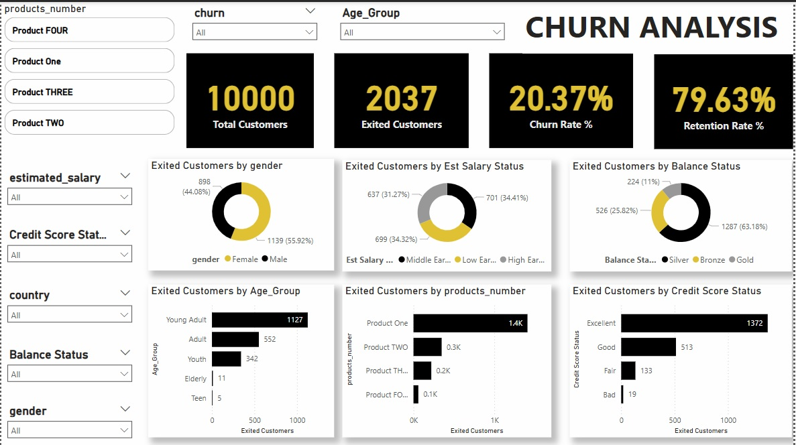

# Churn Analysis Report
The report shows the customer churn for 10,000 customers of ABC Bank, indicating an overall churn rate of 20%. 

## ViSUALISATION 

## KEY FINDINGS 
- GENDER DISTRIBUTION:  Females are exhibiting more Churn rate which stands at 1139 than Male which is 898.
- ESTIMATED SALARY STATUS: Middle earners has the highest churn 701, followed by lower earners at 699. While high earners are listed on the churn rating .
- AGE DISTRIBUTION:  The Young Adults dominate the Churn (1127), while the Teen is the lowest with just 5. 

## RECCOMENDATIONS

I will advice the bank to develop more product the will attract the Females. 
 Since more Young People leaving the banks , I will suggest a workshop is create to first educate on why saving with this bank is beneficial . Secondly we can also develop a Product that will attract the younger generation, eg Product with less charges and seemless transaction . 

